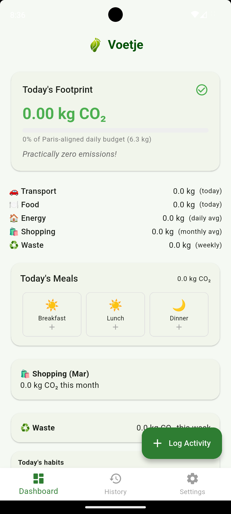
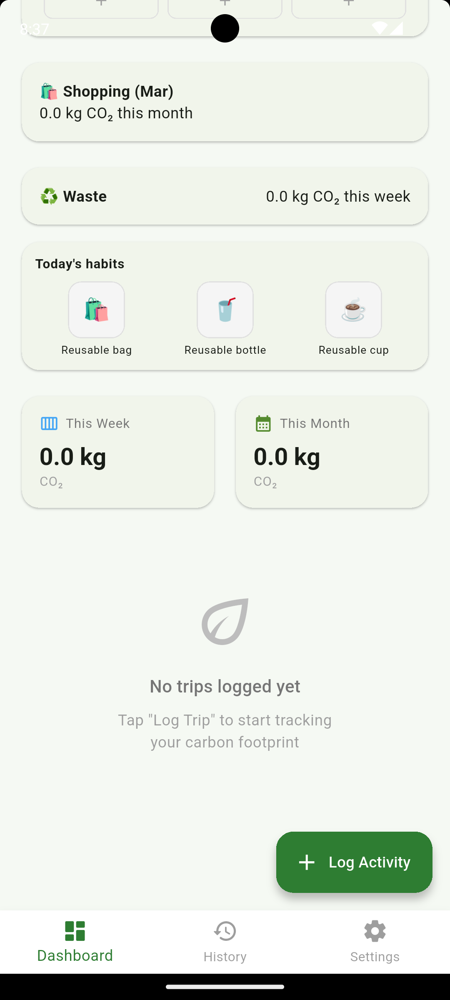
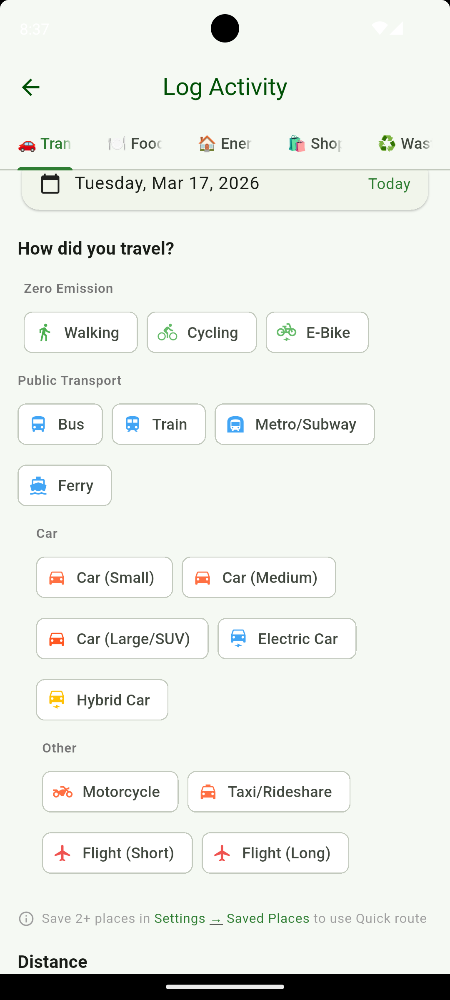
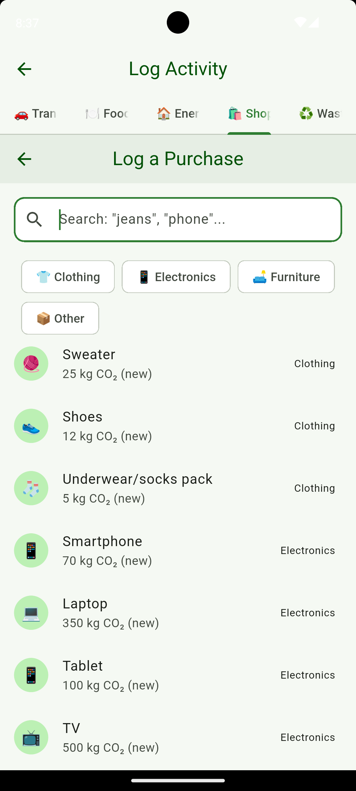

# Voetje

*Dutch for "little footprint" — pronounced roughly "foot-yuh" (IPA: /ˈvutjə/)*

A free, privacy-first personal carbon footprint tracker I built with Flutter and [Claude Code](https://claude.ai/claude-code).

**No ads. No accounts. No data harvesting. All data stays on your device.**

Voetje tracks five categories of personal CO2 emissions — transport, food, home energy, shopping, and waste — using peer-reviewed emission factors from DEFRA, IEA, and EPA. It works completely offline and never phones home.

## How it was built

I have a Master's in Sustainability, so the methodology — which factors to use, what scope boundaries to draw, how to handle edge cases like electric vehicles on different grids or lifecycle vs. manufacture-only CO2 — comes from that background. The coding was done using [Claude Code](https://claude.ai/claude-code) (Anthropic's AI coding assistant) as my development tool.

I'm transparent about this because I think it matters. The domain knowledge and methodology decisions are mine. The code, architecture, and data verification were built collaboratively with AI. Every emission factor is sourced, cited, and documented. The code has 173 passing tests. The [full audit](dev/audit-2026-03.md) and [data source verification](dev/data-sources.md) are public.

## Features

**Transport** — 16 modes from walking to long-haul flights. Carpooling splits emissions by passengers. Airport picker with auto-distance for flights. Saved places and route presets for daily commutes.

**Food** — Log meals by type (plant-based, chicken/fish, red meat, fast food). Automatic meal slot detection. Daily meal summary card. Weekly diet profile.

**Home Energy** — Country-specific grid intensity for 24 countries with state/province overrides (US, Canada, Australia). Enter bills by kWh or cost. Quick estimate mode based on country averages and household size. Supports electricity, gas, oil, and wood heating.

**Shopping** — 25 common items across clothing, electronics, furniture, and other. Manufacture-only CO2 (not lifecycle). Second-hand and repaired items credited with savings.

**Waste & Recycling** — Weekly bin logging (fill fraction or bag count). Recycling counts as net CO2 savings. Daily habit streaks for reusable bags, bottles, and cups.

**Dashboard** — Daily footprint with Paris Agreement budget progress. 7-day bar chart. Category breakdown. Contextual nudge messages. Relatable equivalencies ("like charging 200 smartphones").

## Screenshots

> Early build — updated screenshots coming soon.

<p float="left">
  
  
  
  
</p>

## Getting started

```bash
git clone https://github.com/aswath-space/voetje.git
cd voetje

flutter pub get
flutter run
```

Requires Flutter 3.27+ and Dart 3.11+.

**Platforms tested:** Android, Windows. macOS/Linux should work but are untested. **I don't have a Mac**, so iOS builds are untested — if you can help with that, see [Contributing](#contributing).

## Architecture

```
lib/
├── main.dart / app.dart         # Entry point, MaterialApp, theme
├── config/                      # Theme, routes
├── data/
│   ├── country_defaults.dart    # Single source of truth: 24 countries, grid, kWh, prices, regions
│   ├── emission_factors.dart    # Central registry: all CO2 factors + physical constants
│   ├── item_catalog.dart        # Shopping item catalog (25 items, 4 categories)
│   └── nudge_messages.dart      # Contextual dashboard messages
├── models/                      # Immutable data models + enums with embedded factors
├── providers/
│   └── emission_provider.dart   # Central state (ChangeNotifier + Provider)
├── services/                    # Pure calculation services (no state, no Provider dependency)
├── screens/                     # 14 screens (dashboard, entry forms, settings, setup wizards)
└── widgets/                     # Reusable UI components
```

**State management:** Provider with a single `EmissionProvider` (ChangeNotifier). All DB queries run concurrently via `Future.wait`.

**Database:** SQLite via sqflite. Schema v4 with forward migrations. Foreign key cascades. All data on-device.

**Data layer:** All emission factors, country data, and physical constants live in `lib/data/`. Adding a country = one entry in `country_defaults.dart`. Updating factors = one file (`emission_factors.dart`). Sources and methodology documented in [dev/data-sources.md](dev/data-sources.md).

## Data & Methodology

All CO2 factors are sourced from published, peer-reviewed or government-issued data:

| Category | Primary source |
|----------|---------------|
| Electricity grid | IEA Emissions Factors 2024, EPA eGRID 2023, DEFRA 2024 |
| Transport | UK DEFRA 2023 Conversion Factors |
| Food | Poore & Nemecek 2018 (Science) |
| Shopping | Vendor LCA reports (Apple, Samsung, Dell), WRAP UK |
| Waste | EPA WARM Model, DEFRA 2023 |
| Combustion (gas/oil/wood) | DEFRA 2023 |

Full source citations, methodology decisions, and review cadence in [dev/data-sources.md](dev/data-sources.md).

## Contributing

Contributions are welcome. See [CONTRIBUTING.md](CONTRIBUTING.md) for guidelines.

**Especially wanted:**
- **iOS builds and testing** — I don't have a Mac. Even confirming it builds and runs would be valuable.
- **Country data** — I support 24 countries. Adding yours is a single entry in one file. See [dev/data-sources.md](dev/data-sources.md) for what data is needed.
- **Translation** — the app is currently English-only.

## License

MIT
